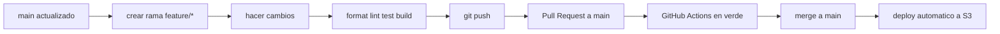

# Flujo de Trabajo para Cambios en Frontend

URL actual del frontend de desarrollo:

`http://aditsystem-dev-mx-central-1-810626480386-frontend.s3-website.mx-central-1.amazonaws.com/`

Por ahora ese es el endpoint para consumir el frontend. Cuando se compre un DNS, se podrá personalizar el dominio y agregar SSL.

## Diagrama rapido



## Flujo recomendado para nuevos cambios

```bash
# 1. Ir al repositorio
cd /ruta/a/ADITSYSTEM

# 2. Cambiar a main
git checkout main

# 3. Bajar cambios recientes
git pull origin main

# 4. Crear una rama nueva para el cambio
git checkout -b feature/nombre-del-cambio

# 5. Instalar dependencias
npm install

# 6. Validar cambios localmente
npm run format:check
npm run lint
npm test
npm run build

# 7. Guardar cambios
git add .
git commit -m "Descripcion corta del cambio"

# 8. Subir la rama
git push -u origin feature/nombre-del-cambio
```

## Despues de subir la rama

1. Abrir un pull request hacia `main`.
2. Esperar a que corran los GitHub Actions.
3. Si todo pasa en verde, hacer merge.
4. El deploy a S3 se ejecuta desde `main`.

## Si necesitas continuar una rama existente

```bash
git fetch origin
git checkout nombre-de-la-rama
git pull origin nombre-de-la-rama
```

## Si necesitas actualizar tu rama con lo ultimo de `main`

```bash
git checkout main
git pull origin main
git checkout feature/nombre-del-cambio
git merge main
```

## Nota

Evitar trabajar directamente sobre `main`. Todo cambio nuevo debe salir desde una rama `feature/*`.
